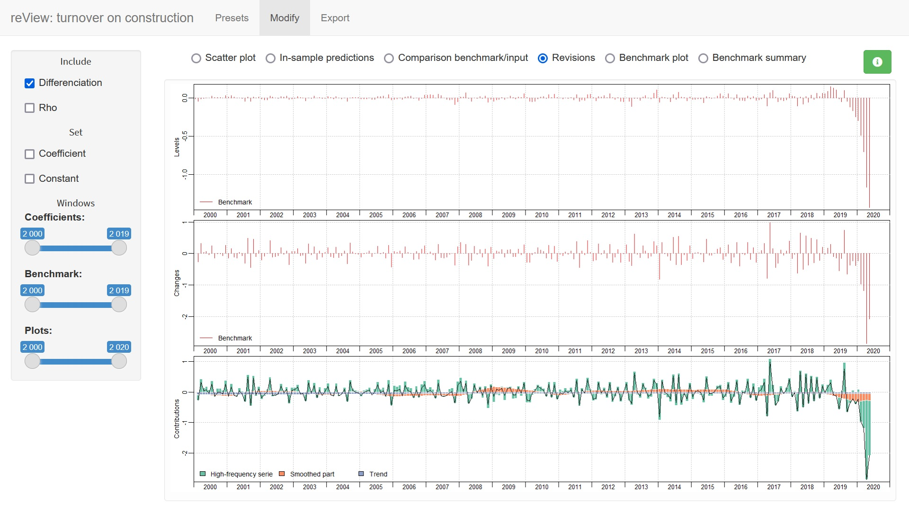

<!-- README.md is generated from README.Rmd. Please edit that file -->

```{r, include = FALSE}
knitr::opts_chunk$set(
  collapse = TRUE,
  comment = "#>",
  fig.path = "man/figures/README-",
  out.width = "100%"
)
```

<!-- badges: start -->

[](https://cran.r-project.org/package=disaggR)
[](https://github.com/InseeFr/disaggR/actions)
[](https://app.codecov.io/gh/InseeFr/disaggR)
[](https://cran.r-project.org/package=disaggR)

<!-- badges: end -->

## Overview

The R package disaggR is an implementation of the French Quarterly National Accounts method for temporal disaggregation of time-series. `twoStepsBenchmark()` and `threeRuleSmooth()` bend a time-serie with another one of a lower frequency.

## Installation

You can install the __stable__ version from [CRAN](https://cran.r-project.org/package=disaggR).

```{r, eval = FALSE}
install.packages("disaggR")
```

You can install the __development__ version from [Github](https://github.com/InseeFr/disaggR).

```{r, eval = FALSE}
# install.packages("devtools")
install_github("InseeFr/disaggR")
```

## Usage

```{r, echo = TRUE, results = 'hide', fig.show="hold", out.width="50%"}
library(disaggR)

benchmark <- twoStepsBenchmark(hfserie = turnover,
                               lfserie = construction,
                               include.differenciation = TRUE)
as.ts(benchmark)
coef(benchmark)
summary(benchmark)
plot(benchmark)
plot(in_sample(benchmark))
```

```{r, echo = TRUE, results = 'hide', fig.show="hold", out.width="50%"}
plot(in_disaggr(benchmark,type="changes"),
     start=c(2015,1),end=c(2020,12))
plot(in_disaggr(benchmark,type="contributions"),
     start=c(2015,1),end=c(2020,12))
```

```{r, echo = TRUE, results = 'hide', fig.show="hold", out.width="50%"}
plot(in_scatter(benchmark))

new_benchmark <- twoStepsBenchmark(hfserie = turnover,
                                   lfserie = construction,
                                   include.differenciation = FALSE)
plot(in_revisions(new_benchmark,
                  benchmark),start = c(2010,1))
```

## Shiny app

You can also use the shiny application __reView__, to easily chose the best parameters for your benchmark.

```{r, echo = TRUE, eval = FALSE}
reView(benchmark)
```

{ width=100% }\