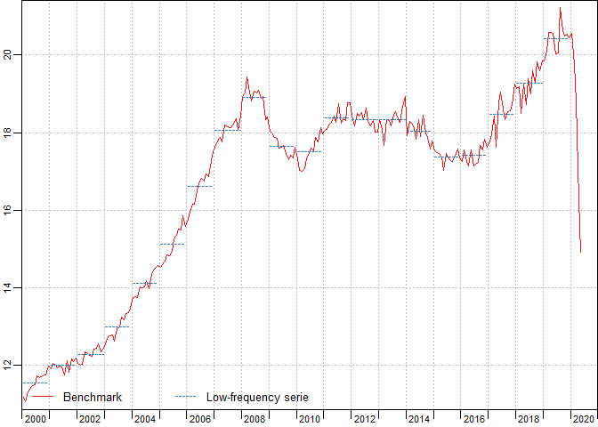
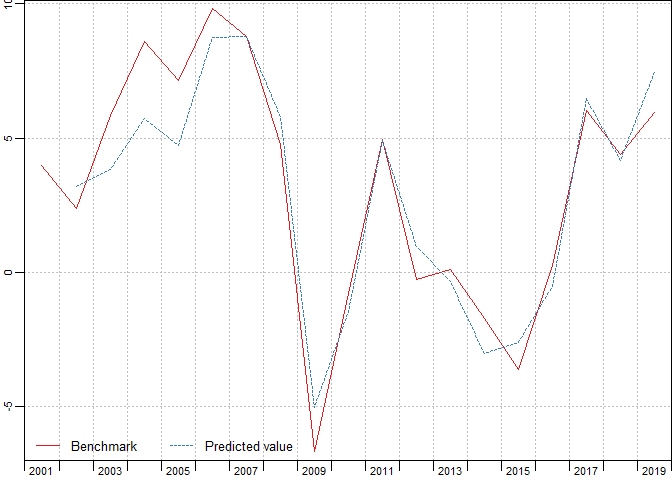
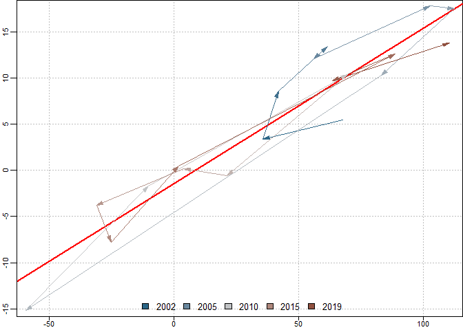

<!-- README.md is generated from README.Rmd. Please edit that file -->

<!-- badges: start -->

[](https://cran.r-project.org/package=disaggR)
[](https://github.com/InseeFr/disaggR/actions)
[](https://codecov.io/gh/InseeFr/disaggR)
[](https://cran.r-project.org/package=disaggR)

<!-- badges: end -->

## Overview

The R package disaggR is an implementation of the French Quarterly
National Accounts method for temporal disaggregation of time-series.
`twoStepsBenchmark()` bends a time-serie with another one of a lower
frequency.

## Installation

You can install the **stable** version from
[CRAN](https://cran.r-project.org/package=disaggR).

``` r
install.packages('disaggR', dependencies = TRUE)
```

You can install the **development** version from
[Github](https://github.com/InseeFr/disaggR).

``` r
# install.packages("devtools")
install_github("InseeFr/disaggR")
```

## Usage

``` r
library(disaggR)

benchmark <- twoStepsBenchmark(hfserie = turnover,
                               lfserie = construction,
                               include.differenciation = TRUE)
as.ts(benchmark)
coef(benchmark)
summary(benchmark)
plot(benchmark)
plot(in_sample(benchmark))
```



``` r
plot(in_dicator(benchmark,type="changes"),
         start=c(2010,1),end=c(2019,12))
plot(in_dicator(benchmark,type="contributions"),
         start=c(2010,1),end=c(2019,12))
```


``` r
new_benchmark <- twoStepsBenchmark(hfserie = turnover,
                                   lfserie = construction,
                                   include.differenciation = FALSE)
plot(in_revisions(new_benchmark,
                      benchmark))
```



## Shiny app

You can also use the shiny application **reView**, to easily chose the
best parameters for your benchmark.

``` r
reView(benchmark)
```


